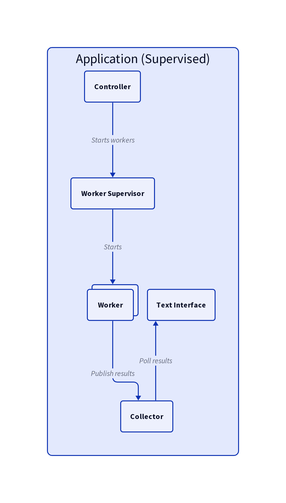

# Application

The structure of the application/runtime looks something like

The components, which corresponds to the Elixir modules in the code, are:
- **Worker**: this is responsible for sending the requests and registering the results.\
  The results are sent to the *Collector*.
- **Collector**: This module holds the responses registered by the workers.
- **Controller**: This is the one starting the workers, which can for instance start\
  by ramping up the number of requests sent.
- **TUI**: The text interface showed presented to the user. This polls the data from the Collector\
  every second to update it.

In Elixir jargon the application is *supervised*, containing the root of the supervision tree.
This means that modules under it are monitored and restarted according to a strategy, if any
error should occurr.
